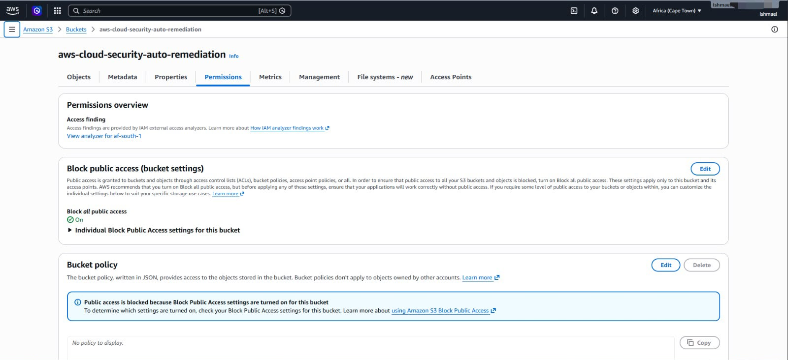

AWS Cloud Security: Self-Healing Architecture

📌 Project Overview

In cloud environments, a single misconfiguration—such as an S3 bucket being accidentally made public—can lead to catastrophic data breaches. This project demonstrates a Serverless Auto-Remediation Pipeline built natively in AWS.

Instead of relying solely on alerts that a human must manually investigate, this architecture automatically detects the misconfiguration in near real-time, instantly revokes public access, and alerts the security team of the action taken.

🏗️ Architecture & Technologies Used

Amazon S3: The target resource (simulating a bucket containing sensitive data).

AWS CloudTrail: The audit trail that detects the API call modifying bucket permissions.

Amazon EventBridge: The rule engine that listens for the specific CloudTrail event and triggers the remediation.

AWS Lambda (Python/Boto3): The serverless "brain" that executes the Python script to forcefully revert the bucket to private.

Amazon SNS: The notification service that sends an immediate email alert detailing the incident and the automated response.

IAM (Identity and Access Management): Strict role-based access control to allow Lambda to modify S3 and publish to SNS.

🚀 Phase 1: Infrastructure Setup (The Target & Alarm)

Objective: Establish the secure baseline and the automated alerting mechanism.

Secure Storage Baseline: Provisioned an Amazon S3 bucket to act as the target resource. Enforced Block Public Access (BPA) at the bucket level to establish a secure, compliant storage baseline prior to emulation.

Automated SOC Alerting: Engineered an Amazon SNS (Simple Notification Service) topic (Security-Alerts). Configured and verified an email subscription to ensure the simulated Security Operations Center (SOC) receives real-time paging when an incident occurs.

Proof of Configuration:

Fig 1:
  

Fig 2: 

🧠 Phase 2: The Logic (Lambda & IAM)

Objective: Create the automation brain with secure, least-privilege permissions.

IAM Execution Role: Engineered a custom IAM policy and role (AutoRemediationRole) for the Lambda function. Adhering strictly to the principle of least privilege, the role was only granted permissions to:

s3:PutBucketPublicAccessBlock (to remediate the specific vulnerability).

sns:Publish (to send the alert to the SOC).

logs:CreateLogStream & logs:PutLogEvents (for standard execution logging).

Serverless Remediation Script: Developed and deployed an AWS Lambda function using Python 3.x and the boto3 SDK. The function is designed to parse the incoming CloudTrail event JSON, extract the affected bucket and the offending IAM user, apply the restrictive security controls, and dispatch the SNS alert.

Lambda Code Snippet (lambda_function.py):

import json
import boto3
import os

def lambda_handler(event, context):
    s3 = boto3.client('s3')
    sns = boto3.client('sns')
    sns_topic_arn = os.environ.get('SNS_TOPIC_ARN')
    
    # Extract details from CloudTrail event
    detail = event.get('detail', {})
    bucket_name = detail.get('requestParameters', {}).get('bucketName')
    user_identity = detail.get('userIdentity', {}).get('arn', 'Unknown User')
    
    if not bucket_name:
        return {"status": "Error", "message": "No bucket name found in the event."}
        
    try:
        # STEP 1: Remediate by blocking all public access
        s3.put_public_access_block(
            Bucket=bucket_name,
            PublicAccessBlockConfiguration={
                'BlockPublicAcls': True,
                'IgnorePublicAcls': True,
                'BlockPublicPolicy': True,
                'RestrictPublicBuckets': True
            }
        )
        
        # STEP 2: Send SOC Alert
        if sns_topic_arn:
            message = (
                f"SECURITY ALERT: Automated Remediation Triggered\n\n"
                f"Bucket Name: {bucket_name}\n"
                f"Action By: {user_identity}\n"
                f"Violation: 'Block Public Access' was disabled.\n\n"
                f"Action Taken: The bucket has been forcefully reverted to Private."
            )
            sns.publish(
                TopicArn=sns_topic_arn,
                Subject=f"AWS Security Alert: {bucket_name} Exposed",
                Message=message
            )
            
        return {"status": "Success", "message": f"{bucket_name} secured."}
        
    except Exception as e:
        return {"status": "Failed", "message": str(e)}

Proof of Configuration:

Fig 3: IAM Role policy showing least-privilege configuration.

Fig 4: Lambda function deployed with environment variables configured.
